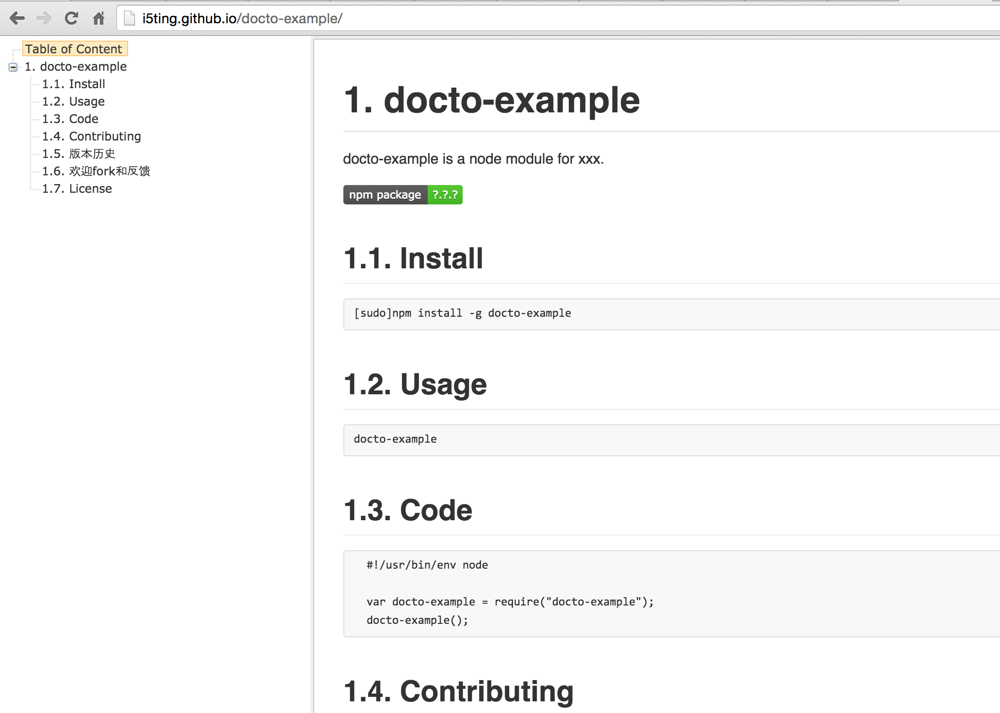

# docto

docto is a Doc Tool for Generate README.md with Toc and Push it to Git Pages

[](http://badge.fury.io/js/docto)



## Features

- 基于nodejs写的，安装简单
- 基于gulp构建，简单易用
- 子项目里无需安装gulp和依赖模块，即可使用
- 初始化README.md
- 自动编译成html
- 自动有基于ztree的toc目录
- 自动发布到git pages

## Install 

```
npm install -g docto
```

## Usages

如果当前不是git仓库，无法使用

1）指定用户和项目

```
docto i5ting/docto
```

2）指定项目（无用户名）

i5ting=git config --global user.name

```
docto docto
```

3）无参数

如果当前是一个git仓库，直接读取

- user
- project

```
docto
```

## 实例

- 文档 http://i5ting.github.io/docto-example
- 代码 https://github.com/i5ting/docto-example

### 初始化git仓库
```
git clone git@github.com:i5ting/docto-example.git
```

### 创建README.md

```
docto i5ting/docto-example
```

### 查看gulp的tasks

```
➜  docto-example git:(master) ✗ gulp -T
[20:56:41] Using gulpfile ~/workspace/github/docto-example/gulpfile.js
[20:56:41] Tasks for ~/workspace/github/docto-example/gulpfile.js
[20:56:41] ├── deploy
[20:56:41] ├── rename
[20:56:41] ├── copy_img
[20:56:41] ├─┬ doc
[20:56:41] │ └── copy_img
[20:56:41] ├─┬ show
[20:56:41] │ └── doc
[20:56:41] └─┬ default
[20:56:41]   ├── doc
[20:56:41]   ├── rename
[20:56:41]   └── deploy
```

### 生成文档

```
gulp doc
```

### 推送到git pages

```
gulp deploy
```

### 默认任务

```
gulp
```

- 编译README.md为preview/README.html
- 修改preview/README.html为preview/index.html
- 推送到git pages

## Test

test cli with 


```
npm link
```


## Contributing

1. Fork it
2. Create your feature branch (`git checkout -b my-new-feature`)
3. Commit your changes (`git commit -am 'Add some feature'`)
4. Push to the branch (`git push origin my-new-feature`)
5. Create new Pull Request

## 版本历史

- v1.0.0 初始化版本

## 欢迎fork和反馈

- write by `i5ting` i5ting@126.com

如有建议或意见，请在issue提问或邮件

## License

this repo is released under the [MIT
License](http://www.opensource.org/licenses/MIT).
